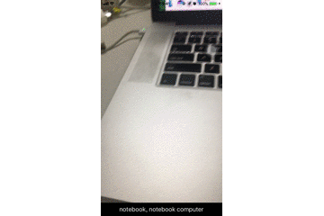

# CoreML_Inceptionv3

### 相机调用
1. info.plist 添加调用相机请求
2. 相机调用请求
3. 相机数据输出的delegate

#### 实例化对象
* 摄像显示区域
* 相机调用请求
* 相机数据输出
* 线程
* 数据显示
* InceptionvModel
* InceptionvModel输出

<pre>
@property (nonatomic,strong) AVCaptureVideoPreviewLayer
*previewLayer; 
@property (nonatomic,strong) AVCaptureSession *session;
@property (nonatomic,strong) AVCaptureVideoDataOutput *videoOutPut;
@property (nonatomic,strong) AVCaptureConnection *videoConnection;
@property (nonatomic,strong) dispatch_queue_t videoQueue;
@property (nonatomic,strong) UILabel *resultLabel;
@property (nonatomic,strong) Inceptionv3 *InceptionvModel;
@property (nonatomic,strong) Inceptionv3Output *outPut;
</pre>

#### 相机调用请求
<pre>
self.session = [[AVCaptureSession alloc] init];
    
    //视频
    AVCaptureDevice *videoDevice = [AVCaptureDevice defaultDeviceWithMediaType:AVMediaTypeVideo];
    if (videoDevice.isFocusPointOfInterestSupported && [videoDevice isFocusModeSupported:AVCaptureFocusModeContinuousAutoFocus]) {
        [videoDevice lockForConfiguration:nil];
        [videoDevice setFocusMode:AVCaptureFocusModeContinuousAutoFocus];
        [videoDevice unlockForConfiguration];
    }
    
    AVCaptureDeviceInput *cameraDeviceInput = [[AVCaptureDeviceInput alloc] initWithDevice:videoDevice error:nil];
    
    
    if ([self.session canAddInput:cameraDeviceInput]) {
        [self.session addInput:cameraDeviceInput];
    }
    
    //视频
    self.videoOutPut = [[AVCaptureVideoDataOutput alloc] init];
    NSDictionary * outputSettings = [[NSDictionary alloc] initWithObjectsAndKeys:[NSNumber numberWithInt:kCVPixelFormatType_32BGRA],(id)kCVPixelBufferPixelFormatTypeKey, nil];
    [self.videoOutPut setVideoSettings:outputSettings];
    if ([self.session canAddOutput:self.videoOutPut]) {
        [self.session addOutput:self.videoOutPut];
    }
    self.videoConnection = [self.videoOutPut connectionWithMediaType:AVMediaTypeVideo];
    self.videoConnection.enabled = NO;
    [self.videoConnection setVideoOrientation:AVCaptureVideoOrientationPortrait];
</pre>

#### 初始化预览层
<pre>
 self.previewLayer = [[AVCaptureVideoPreviewLayer alloc] initWithSession:self.session];
    [self.previewLayer setVideoGravity:AVLayerVideoGravityResizeAspectFill];
</pre>

#### 打开相机
<pre>
 [self.session startRunning];
    self.videoConnection.enabled = YES;
    self.videoQueue = dispatch_queue_create("videoQueue", NULL);
    [self.videoOutPut setSampleBufferDelegate:self queue:self.videoQueue];
</pre>

#### 关闭相机
<pre>
[self.videoOutPut setSampleBufferDelegate:nil queue:nil];
    self.videoConnection.enabled = NO;
    self.videoQueue = nil;
    [self.session stopRunning];
</pre>

### CoreML数据输出
1. 获取相机数据输出的CMSampleBufferRef
2. 转换成UIImage大小为299.299
3. 输出为Inceptionv3Output

#### 下载Inceptionv3.mlmodel
1. target->build phases->compile sources 添加Inceptionv3.mlmodel
2. 导入头文件Inceptionv3.h

#### 数据转换
<pre>
-(UIImage *)image:(CGSize)resize{
    UIGraphicsBeginImageContext(resize);
    [self drawInRect:CGRectMake(0, 0, resize.width, resize.height)];
    UIImage * image = UIGraphicsGetImageFromCurrentImageContext();
    UIGraphicsEndImageContext();
    return image;
}
</pre>

#### 数据输出
<pre>
-(void)imageOutput:(CMSampleBufferRef)sampleBuffer{    
    CVImageBufferRef imageBuffer = CMSampleBufferGetImageBuffer(sampleBuffer);
    CIImage * ciImage = [CIImage imageWithCVImageBuffer:imageBuffer];
    
    Inceptionv3Image * uiImage =[[Inceptionv3Image alloc]initWithCIImage:ciImage];
    UIImage * uiimage = [uiImage image:CGSizeMake(299, 299)];
    
    CGImageRef cgImage = uiimage.CGImage;
    CVPixelBufferRef pixelBuffer = [ImageConvert pixelBufferFromImage:cgImage];
    self.InceptionvModel = [[Inceptionv3 alloc]init];
    self.outPut =  [self.InceptionvModel predictionFromImage:pixelBuffer error:nil];
}
</pre>

#### 在AVCaptureOutputDelegat回调方法中开启线程
1. 把相机输出的数据转换成Inceptionv3接收的数据
2. 在主线程刷新界面

<pre>
dispatch_queue_t queue = dispatch_queue_create("CMSampleBufferRef", NULL);
    dispatch_sync(queue, ^{
        [self imageOutput:sampleBuffer];
        dispatch_async(dispatch_get_main_queue(), ^{
            self.resultLabel.text = self.outPut.classLabel;
        });
    });
</pre>
